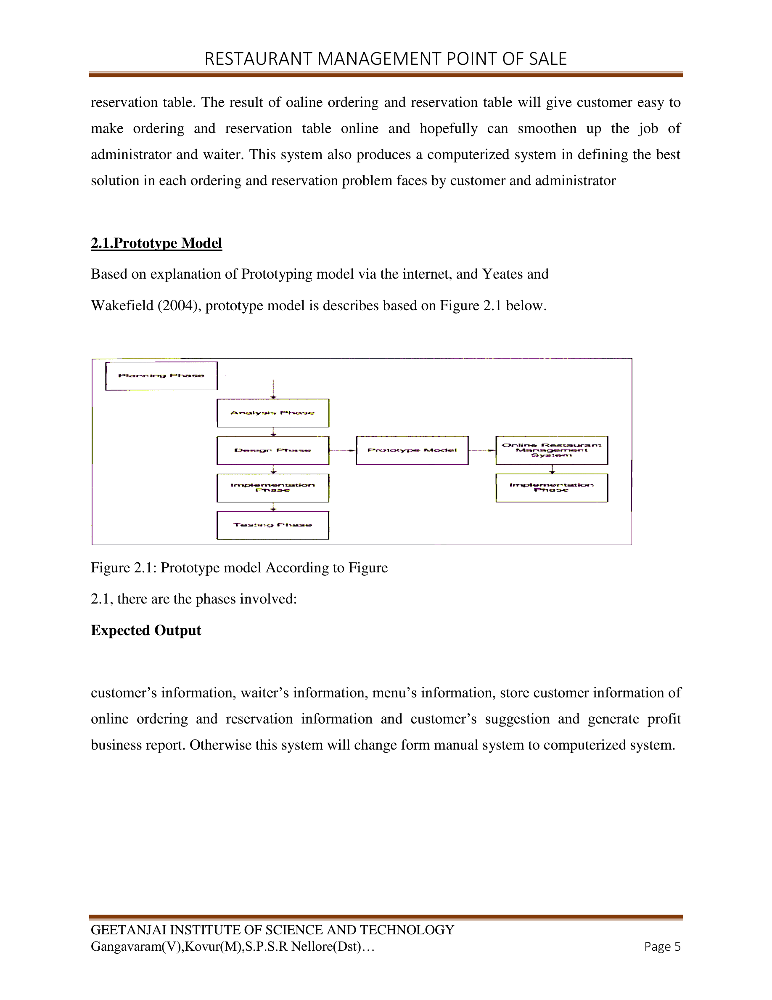
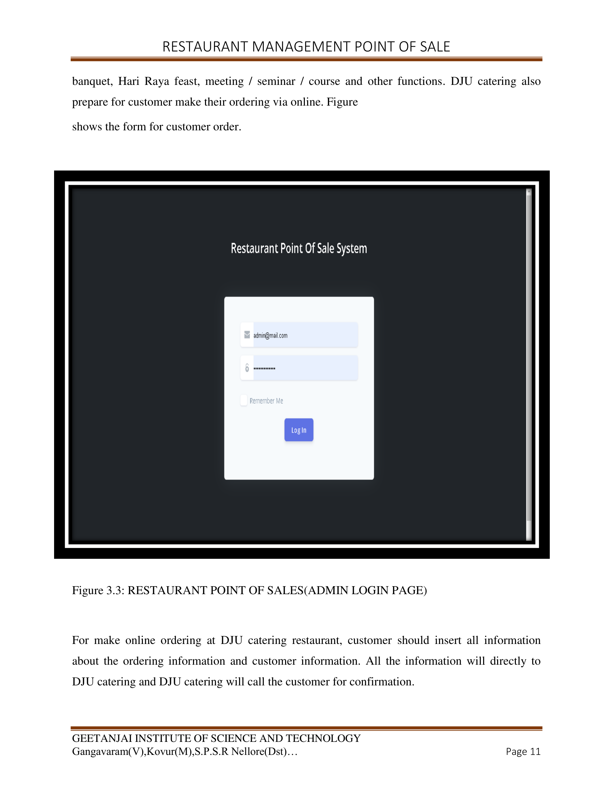
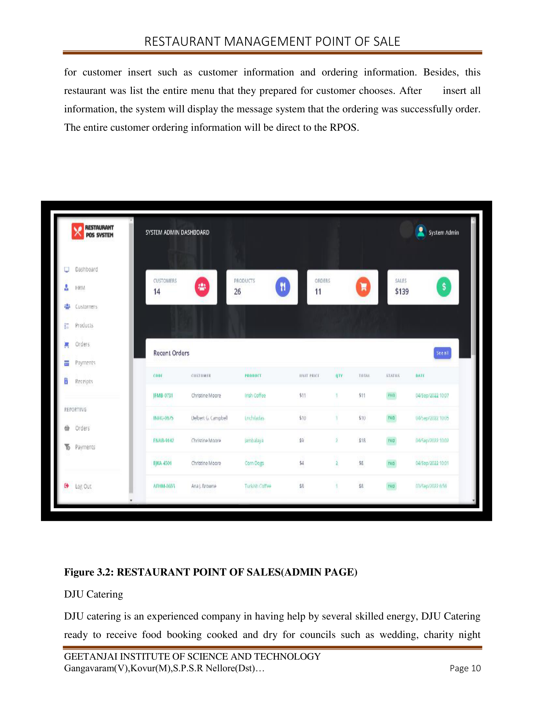
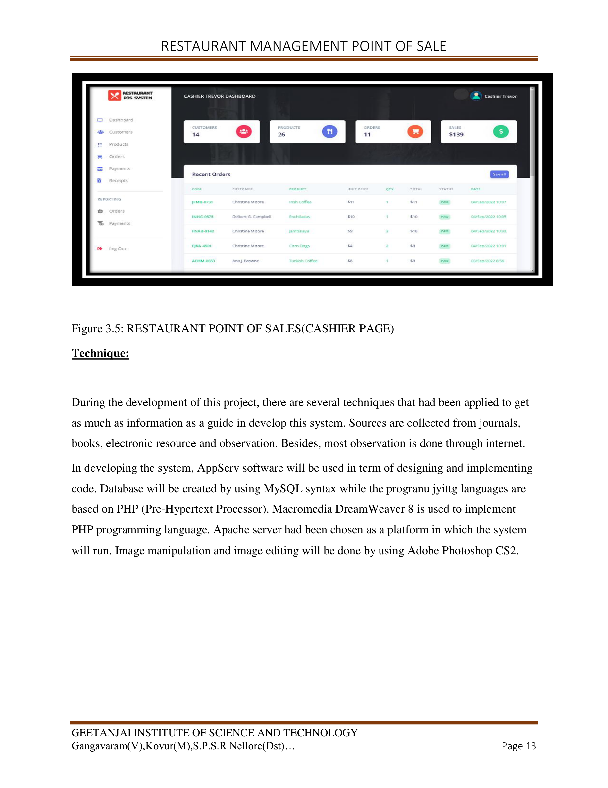
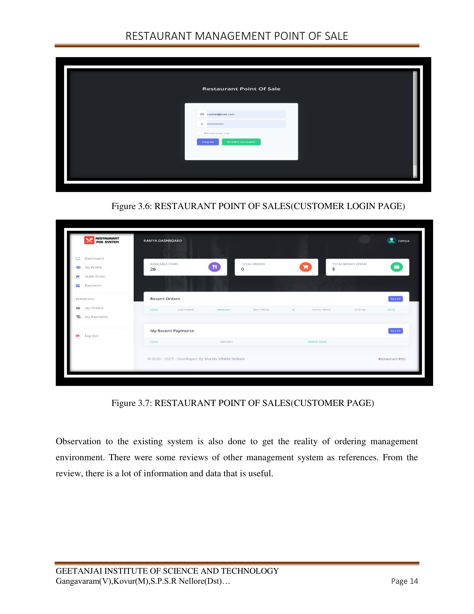

# 🍽️ Restaurant Management System

## 📌 Project Overview

Restaurant Management System is a web-based application developed using PHP and MySQL to automate restaurant operations. The system provides separate modules for Admin, Cashier, and Customers to efficiently manage orders, payments, reports, and customer information.

---

## 🚀 Features

- User Authentication
- Admin Dashboard
- Customer Management
- Order Management
- Billing System
- Payment Tracking
- Reports Generation
- Restaurant Database Management

---

## 🛠 Technologies Used

- PHP
- MySQL
- HTML
- CSS
- JavaScript
- Bootstrap

---

## 👨‍💼 Admin Module

- Manage Customers
- Manage Orders
- View Reports
- Track Payments
- Dashboard Analytics

---

## 💰 Cashier Module

- Generate Bills
- Process Payments
- View Orders
- Manage Transactions

---

## 👤 Customer Module

- Place Orders
- View Order History
- Manage Profile
- Track Payments

---

## 📷 Project Screenshots

### Prototype Model

### Admin Login

### Admin Dashboard

### Cashier Module

### Customer Module

---

## 🔑 Login Credentials

Refer to:

`01 LOGIN DETAILS & PROJECT INFO.txt`

for Admin, Cashier, and Customer login details.

---

## 🗄 Database

Database file is included in:

`DATABASE FILE`

---

## 🎯 Project Objective

To simplify restaurant operations by integrating customer management, billing, ordering, payment tracking, and reporting into a single platform.

---

## 👩‍💻 Author

** Kotapaty Ramya Sree**

B.Tech – Computer Science Engineering

GitHub:
https://github.com/kotapatyramya-cseds
